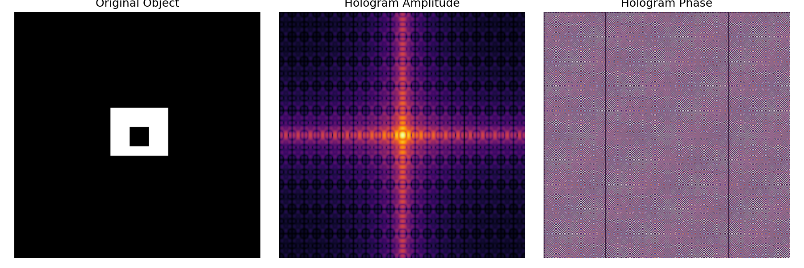

# Detecting-cloaked-objects-using-Fourier-holograms
## 📄 Abstract
This project presents a concise simulation of digital holography using Fourier-domain analysis. A synthetic object. a rectangular aperture with an embedded void is encoded into a hologram via the two-dimensional Fourier transform. The resulting hologram is decomposed into amplitude and phase components, which are visualized to reveal the spatial frequency structure and phase encoding of the object.
The simulation highlights the role of phase in holographic imaging, where the object’s geometry is embedded not only in intensity but in the complex wavefront. By isolating and visualizing the phase component, the simulation underscores the importance of phase-only holography in applications such as optical encryption, wavefront shaping, and computational imaging. This work reflects foundational skills in numerical modeling, signal decomposition, and scientific visualization core competencies for graduate-level research in optics and photonics.

## 🚀 How to Run
Run the script: main.py

This will generate and save:
• 	A three-panel image showing the object, hologram amplitude, and phase
• 	A standalone phase-only hologram image
All outputs are saved in the  directory.

## 📚 Concepts Illustrated
• 	2D Fourier transform in optics
• 	Hologram formation and decomposition
• 	Phase encoding and visualization
• 	Digital holography and wavefront analysis

## 🎓 Research Relevance
This project demonstrates key competencies in:
• 	Fourier-domain modeling of optical systems
• 	Phase analysis and holographic encoding
• 	Scientific visualization and signal decomposition
It aligns with graduate-level research in computational optics, holography, and inverse imaging.

## 👤 Author
Developed by Alhassan Kpahambang Fuseini.

## 📄 License
This project is licensed under the MIT License. Feel free to use, modify, and share with attribution.
